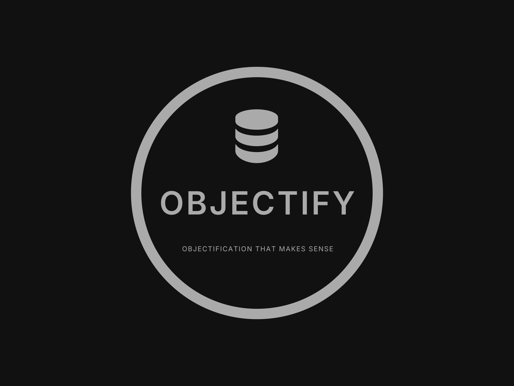
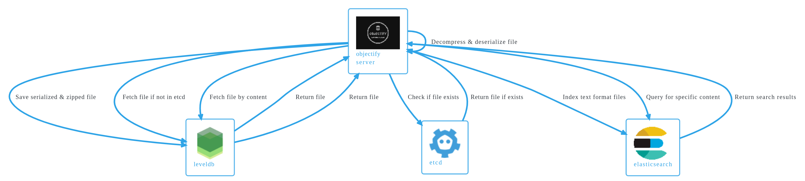

   

objectify is an object/blob with [LevelDB](https://github.com/google/leveldb) as the underlying database.

## Inspiration

objectify was inspired by

- Akhil Sharma's [Building Your Own Database From Scratch](https://www.youtube.com/watch?v=0NQ23euDD5w&list=PL5dTjWUk_cPYztKD7WxVFluHvpBNM28N9&index=19&pp=iAQB),
- One of the interview related assignments that required to build a file system based object store, and
- My own itch to tinker.

## Components

Following the spirit of the project quote, objectify is composed of the following components:

- objectify: database allowing file storage using LevelDB
- etcd cluster: centralized caching and metadata storage
- elastic search: for text based file/content search and retrieval

## Architecture

   

## Disclaimer

Development on this project does not follow any release cycle, and updates/changes will be made per the requirements of my personal projects.
If you would like objectify to have a specific feature/optimization, please feel free to raise an issue, but I might take up the issue in my own time/on my whim. So feel free to look at the project [LICENSE](./LICENSE) and start your own fork.

## [License](./LICENSE)

*The logo is built using [logo.com](https://logo.com/)*.
